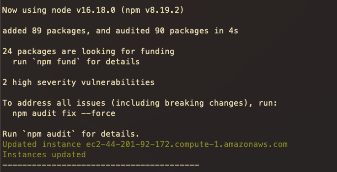

# AYGO 03

Deploy AWS infrastructure and a simple web application using the AWS-CLI in a shell script.

# Pre-requisites

- NPM
- AWS-CLI v2.x

# Webapp

A simple ReactJs webapp, check [simple-app-react](simple-app-react/)

# Script

Check it on [deploy-aws.sh](deploy-aws.sh)

```bash
./deploy-aws.sh -h

USAGE: deploy-aws.sh [OPTIONS]
  Options:
    -h Print this help message
    -k AWS Key Pair Name (default: mykey)
    -s Security Group Name (default: my-sg)
```

# Results

Executed the script as `./deploy-aws.sh -k aygo-03 -s my-sg-sh`

## Security group and Instances creation


## Updating the Instances

- Updating


- Installing npm and serve



## Building the webapp and uploading to instances


## Running the webapp on each instance


## Created instances on EC2


## Running app on the three instances


# License

GNU GENERAL PUBLIC LICENSE [LICENSE.md](LICENSE.md)

# Author

- Julián Benítez Gutiérrez - _Development_ - [julianbenitez99](https://github.com/julianbenitez99)
